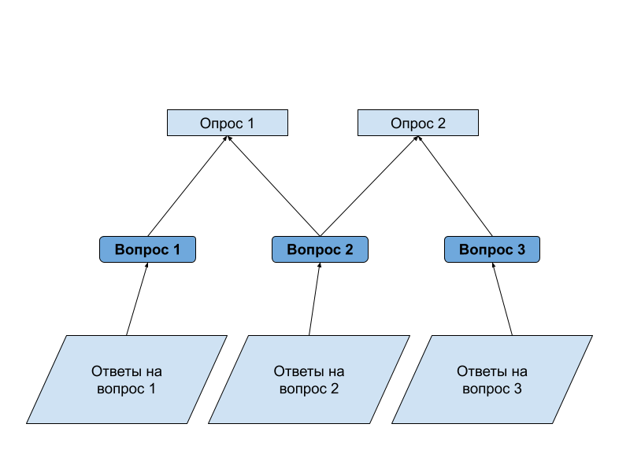

# Сто к одному

## Описание

**Hundred to One** - сайт, помогающий ведущему проводить аналог телеигры "Сто к одному".

### Фичи

#### Система опросов

Пользователь может создавать объекты вопросов и конструировать из них опросы с публичными ссылками. Ответы
обрабатываются автоматически, первым шести, исходя из количества ответов, назначается количество очков. Ручная проверка
позволяет отсеять спам.

#### Регистрация, авторизация и личный кабинет

Вопросы и опросы хранятся в личном кабинете. Пользователь может составлять игры, добавляя в нее 7 вопросов (см.
[структуру игры](docs/game_rules.md)).

#### Проведение игр

Сайт позволяет проводить игры на нем: показываются текущий раунд, размер фонда, названия команд, количество
промахов и т.п. Содержание игры рендерится отдельно, и его можно либо смотреть на отдельном устройстве, либо
распечатать. Открытие строк с ответами, промахи и прочее осуществляется пользователем мышкой. Сайт – лишь интерфейс и не
заменяет ведущего.

## Техническое задание

### Регистрация и авторизация

Для использования сайта необходимо обязательно войти в систему. Регистрация и авторизация находятся на отдельной
странице. Переключение между ними не меняет страницу.

Для регистрации пользователю необходимо предоставить адрес электронной почты, задать никнейм и придумать пароль.
Никнейм – способ обращаться, он не уникален. В базе данных пароль хранится зашифрованным.

**Примерные схемы данных**

| **Поле**    | **Ограничение**                                                  |
|-------------|------------------------------------------------------------------|
| **Почта**   | Валидный имейл. Длина [5;100] символов. Значения в БД уникальны. |
| **Никнейм** | Длина [6;30] символов.                                           |
| **Пароль**  | Длина [8;60] символов. Допускаются латиница, цифры, спецсимволы. |

При регистрации есть дополнительное поле для подтверждения пароля. Валидация данных происходит дважды: на стороне
клиента – показываем, что неправильно, и на сервере – проверяем, что вработу JS не вмешались. Для входа в аккаунт
необходимо ввести почту и пароль.

### Система вопросов

Для создания игр используются вопросы с собранной по ним статистике ответов. Чтобы собрать статистику для вопроса на
сайте можно использовать два варианта:

1. Более простой - самостоятельно придумать данную статистику. В этом случае пользователь вводит 6 ответов и количество
   баллов для каждого из них (в сумме – 100).
2. Можно собирать реальную статистику от респондентов, пользуясь встроенной на сайте системой опросов:
   

Центральными объектами системы являются вопросы. Они являются независимыми объектами, из которых можно собирать опросы.
Респонденты могут проходить опросы, переходя по ссылкам, которые им даст пользователя. Их ответы будут записываться в
статистику вопроса из всех опросов, в которых он есть. Статистика формируется автоматически, автор может удалять ответы
вручную.

**Примерные схемы данных**

<table>
    <tr>
        <th>Поле</th>
        <th>Ограничение</th>
    </tr>
    <tr>
        <td colspan="2" align="center"><strong>Вопрос</strong></td>
    </tr>
    <tr>
        <td>ID</td>
        <td>UUID, первичный ключ</td>
    </tr>
    <tr>
        <td>Название</td>
        <td>Значения, относящиеся к одному пользователю, уникальны. Длина [4; 250] символов.</td>
    </tr>
    <tr>
        <td>ID пользователя</td>
        <td>Внешний ключ, UUID</td>
    </tr>
    <tr>
        <td colspan="2" align="center"><strong>Ответ</strong></td>
    </tr>
    <tr>
        <td>ID</td>
        <td>UUID, первичный ключ</td>
    </tr>
    <tr>
        <td>Содержание</td>
        <td>Длина [1;40] символов.</td>
    </tr>
    <tr>
        <td>ID вопроса</td>
        <td>Внешний ключ, UUID</td>
    </tr>
    <tr>
        <td colspan="2" align="center"><strong>Опрос</strong></td>
    </tr>
    <tr>
        <td>ID</td>
        <td>UUID, первичный ключ</td>
    </tr>
    <tr>
        <td>Название</td>
        <td>Длина [2;70] символов.</td>
    </tr>
    <tr>
        <td>ID пользователя</td>
        <td>Внешний ключ, UUID</td>
    </tr>
    <tr>
        <td colspan="2" align="center"><strong>Связь опрос-вопрос</strong></td>
    </tr>
    <tr>
        <td>ID</td>
        <td>UUID, первичный ключ</td>
    </tr>
    <tr>
        <td>ID опроса</td>
        <td>Внешний ключ, UUID</td>
    </tr>
    <tr>
        <td>ID вопроса</td>
        <td>Внешний ключ, UUID</td>
    </tr>
</table>

### Личный кабинет: настройки аккаунта, управление вопросами и опросами

Личный кабинет представляет собой страницу с группой разделов, между которыми пользователь может переключаться, а также
кнопкой для выхода из аккаунта.

Переходы между разделами и управление объектами разделов осуществляется с помощью кнопок.

#### Раздел для настройки аккаунта

В данном разделе пользователь может изменить все данные о своем аккаунте: никнейм, почту и пароль. Также доступно
удаление учетной записи. Все действия подтверждаются введением текущего пароля.

#### Раздел для управления вопросами

Для создания объекта вопроса пользователю необходимо заполнить форму из одного поля - название вопроса.

Объект вопроса можно удалить при условии, что тот не связан хоть с каким-то опросом.

Для управления ответами на вопрос необходимо перейти на другую страницу, где пользователю будет доступна возможность
управления ответами, которые были получены при прохождении респондентами связанных опросов.

На этой странице пользователь также может формировать статистику по вопросу, делая это на основании полученных ответов
или вручную, искусственно, как это описывалось в пункте про систему вопросов.

#### Раздел для управления опросами

Для создания опроса пользователю необходимо кликнуть на кнопку и выбрать из появившегося списка галочками те вопросы,
которые следует включить в опрос.

После создания опроса появляется объект опроса и его публичная ссылка, позволяющая поделиться им с респондентами. В
случае, если все вопросы, связанные с опросом, будут закрыты, то закроется и сам опрос.

Принцип удаления опросов такой же как и у вопросов, но в данном случае при удалении из БД будут стираться все записи о
связях опроса с его вопросами. Сами вопросы и ответы пользователей не будут подвергаться удалению.

### Прохождение опросов респондентами

У каждого опроса для его прохождения будет своя собственная страница, сделанная по единому шаблону.

Страница-шаблон включает в себя форму со всеми вопросами опроса, т. е. пользователь, попавший на эту страницу не
имеет возможности переходить на другие страницы и как-либо взаимодействовать с сайтом, кроме как заполнить форму.
